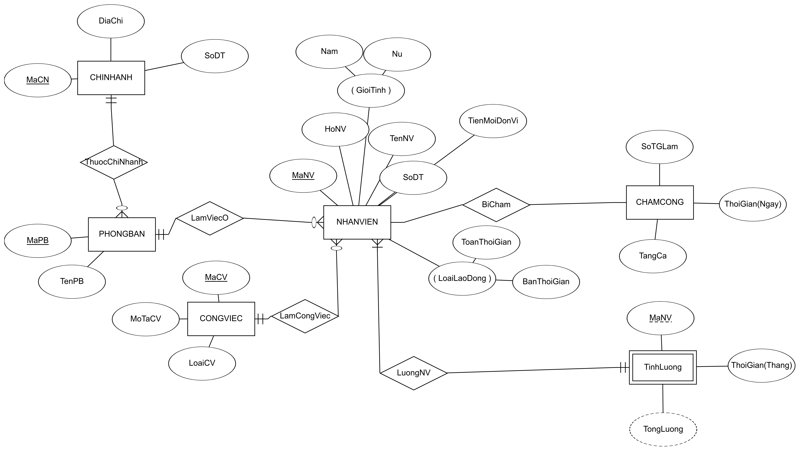

# Quản lý lương nhân viên

## Giới thiệu

## Đặc tả

### Nhân viên

- Nhân viên là lao động chính của công ty.
- Thông tin cá nhân.
- Thông tin về **phòng ban** và **chi nhánh** mà nhân viên làm việc.
- **Loại lao động** bao gồm *Toàn thời gian* và *Bán thời gian*.
- **Công việc** mà nhân viên làm.

### Phần dành cho kế toán

- Kế toán là người làm việc liên quan đến lương.
- Mỗi tháng, kế toán tính lương của nhân viên, và phân loại theo phòng ban, theo công việc.
- Lương của nhân viên được tính dựa theo **Loại lao động**, **Công việc**, **Thời gian làm việc** và **Thời gian tăng ca**.

### Phần dành cho người quản lý (quản lý tất cả phòng ban)

- Người quản lý quản lý nhân viên:
    - Sửa thông tin cá nhân của nhân viên.
    - Chỉnh sửa loại công việc, phòng ban mà nhân viên làm việc.

- Người quản lý quản lý phòng ban:
    - Sửa thông tin của các phòng ban, địa chỉ các phòng ban.

- Người quản lý chấm công nhân viên:
    - Thực hiện việc chấm công nhân viên mỗi ngày.
    - Mỗi tháng, người quản lý thống kê thời gian làm việc của nhân viên, thời gian tăng ca trong tháng, và phân loại theo các phòng ban.

## Sơ đồ ERD

> NOTE
> 1. kế toán - làm việc liên quan đến lương: trung bình lương tổng, trung bình lương theo phòng, trung bình lương theo công việc; sắp xếp lương của nhân viên trong phòng ban hoặc tổng nhân viên; tổng lương theo tháng của phòng ban;
> 2. quản lý (quản lý nhiều phòng ban) - làm việc liên quan đến nhân viên và chấm công: tìm ra những nhân viên đi làm đầy đủ/nghỉ nhiều; số giờ tăng ca trong tháng của nhân viên theo phòng ban(hoặc tổng) và sắp xếp; số thời gian làm; sửa thông tin cá nhân nhân viên, phòng ban, chi nhánh, công việc;
> - Hệ số: toàn thời gian = 1, bán thời gian = 0.75, tăng ca = 1.5, loại công việc
> - Công việc chỉ có thêm sửa